# Harbor Tracking App 使用者操作手冊

## 目錄
1. [1. 系統介面概覽](#1-系統介面概覽)
2. [2. Live Stream 即時影像監控](#2-live-stream-即時影像監控)
3. [3. Region Mapper 區域設定](#3-region-mapper-區域設定)
4. [4. Region Monitor 區域監控](#4-region-monitor-區域監控)
5. [5. Settings 系統設定](#5-settings-系統設定)
6. [6. 常見問題與解決方案](#6-常見問題與解決方案)
7. [7. 技術支援與聯絡資訊](#7-技術支援與聯絡資訊)

---

## 1. 系統概述

Harbor Tracking App 是一個先進的港口監控系統，提供即時影像分析、自定義區域監控和智能物件偵測功能。

硬體需求：
* 顯卡：須為 Nvidia GPU，建議 30 系列或以上。
* 記憶體：建議 32 GB 或以上。
* 作業系統：須為 Windows 11 或 Linux OS。
* 軟體：須安裝 Docker Desktop 或 Docker。
* 網路速度：足夠傳輸攝影機即時串流影像。

### 1-1. 主要功能模組

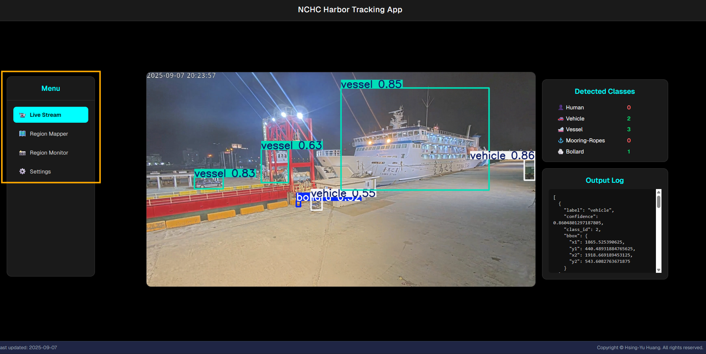

系統包含四個主要模組：
- **Live Stream**: 即時影像監控與物件偵測
- **Region Mapper**: 自定義監控區域設定
- **Region Monitor**: 區域監控與自動截圖
- **Settings**: 系統設定與參數調整

### 1-2. 導航使用說明

1. 點擊頂部導航欄中的任一模組按鈕即可切換功能
2. 當前選中的模組會以醒目的青色高亮顯示
3. 各模組之間的資料會自動同步

---

## 2. Live Stream 即時影像監控

Live Stream 模組提供即時影像串流監控功能，支援多種物件偵測和視覺化選項。

### 2-1. 功能概覽

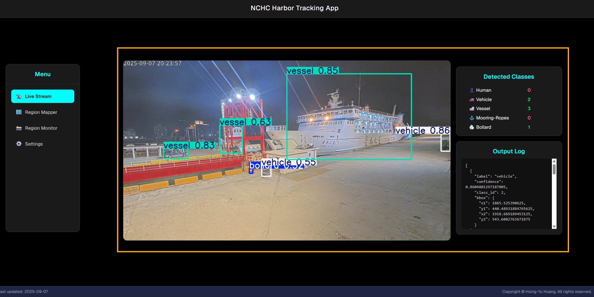

### 2-2. 物件偵測設定

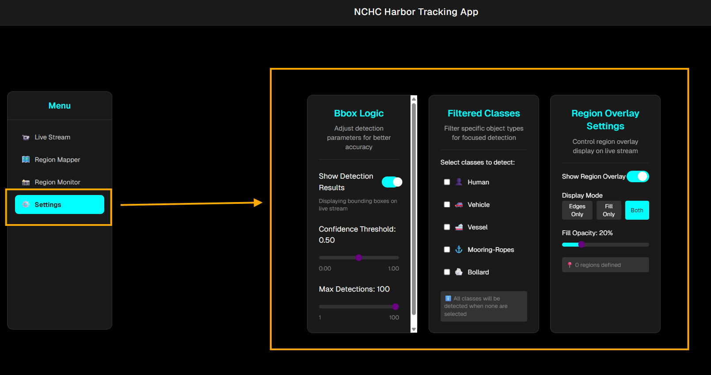

#### 2-2-1. Bbox Logic 邊界框邏輯設定

* **啟用/關閉偵測顯示**
    * 點擊「Show Detection Results」開關
    - 藍色表示已啟用偵測顯示(如圖所示)
    - 灰色表示已關閉偵測顯示
 
* **信心度閾值 (Confidence Threshold)**
    * 使用滑桿調整偵測物件的信心度門檻值
    * 數值越高，偵測結果越嚴格(建議值：0.5)
 
* **最大偵測數量 (Max Detections)**
    * 設定單一畫面中最多顯示的偵測物件數量
    * 範圍：1 - 100，建議值：20-50

#### 2-2-2. Filtered Classes 物件類別篩選

1. 在「Filtered Classes」中選擇要偵測的物件類型
2. 支援的物件類型包括：
    - 🚢 Vessel (船隻)
    - 🚗 Vehicle (車輛)
    - 🪨 Bollard (繫船樁)
    - 👤 Human (人)

3. 操作步驟：
    - 點擊物件類型前的核取方塊進行選擇
    - 已選擇的類型會顯示勾號
    - 可以多選或全選
    - 底部會顯示已選擇的類型數量

#### 2-2-3. Region Overlay Settings 區域疊加設定

* **啟用區域疊加**
    * 點擊「Show Region Overlay」開關啟用，啟用後會顯示用戶繪製的切割區域於 Live Stream 畫面上。

* **疊加模式選擇**
    * **Fill Mode (填充模式)**: 以半透明色彩填充區域
    * **Edges Mode (邊界模式)**: 僅顯示區域邊界線
    * **Both Mode (混合模式)**: 同時顯示填充和邊界

* **透明度調整**
    * 使用「Fill Opacity」滑桿調整填充透明度
    * 範圍：0% - 100%，建議值：20% - 40%

---

## 3. Region Mapper 區域設定

Region Mapper 模組用於建立自定義監控區域，這些區域將用於後續的智能監控功能。

### 3-1. 介面佈局

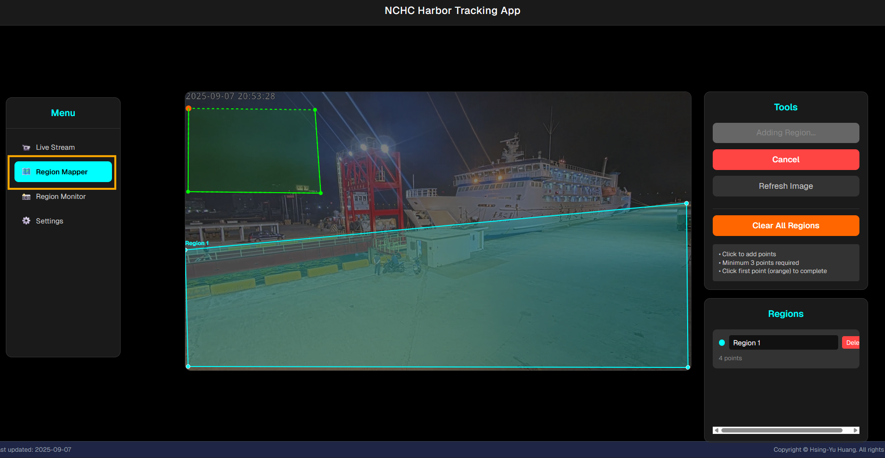

界面分為兩個主要部分：
- **左側**: 靜態影像區域，用於繪製監控區域
- **右側**: 工具面板和區域管理

### 3-2. 建立新的監控區域

#### 3-2-1. 步驟 1: 開始建立區域

* **操作方法**
    * 點擊「Add Region」按鈕
    * 滑鼠游標會變成十字準星
    * 背景影像會變為半透明狀態，表示進入編輯模式
    * 如果影像串流卡住，可點擊「Refresh Image」按鈕重新載入背景影像。
 

#### 3-2-2. 步驟 2: 繪製區域邊界

* **操作方法**
    * 在影像上點擊滑鼠左鍵標記第一個點
    * 繼續點擊以添加更多邊界點
    * 最少需要 3 個點才能形成有效區域
    * 第一個點會以橙色圓圈特別標示
 

#### 3-2-3. 步驟 3: 繪製區域邊界

* **操作方法**
    * 在影像上點擊滑鼠左鍵標記第一個點
    * 繼續點擊以添加更多邊界點
    * 最少需要 3 個點才能形成有效區域
    * 第一個點會以橙色圓圈特別標示
 

#### 3-2-4. 步驟 4: 完成區域建立

* **操作方法**
    * 當您繪製了足夠的邊界點後，點擊第一個橙色點
    * 系統會自動連接所有點形成封閉區域
    * 區域會以彩色填充和邊界線顯示
 

### 3-3. 編輯現有區域

#### 3-3-1. 調整區域邊界

* **操作方法**
    * 將滑鼠懸停在任一區域的邊界點上
    * 常按邊界點會放大並顯示白色光暈
    * 按住滑鼠左鍵拖曳即可移動該點
    * 鬆開滑鼠完成調整
 

#### 3-3-2. 重新命名區域

* **操作方法**
    * 在右側「Regions」列表中找到要編輯的區域
    * 點擊區域名稱的文字輸入框
    * 輸入新的區域名稱
    * 按 Enter 鍵或點擊其他地方保存
 

#### 3-3-3. 刪除區域

* **操作方法**
    * 在區域列表中找到要刪除的區域
    * 點擊該區域右側的「Delete」按鈕
    * 區域會立即從影像和列表中移除
    * 或點擊橘色「Clear All Regions」按鈕，會移除所有區域
 

---

## 4. Region Monitor 區域監控

Region Monitor 模組提供基於區域的智能監控功能，能夠自動偵測指定區域內的物件活動並進行截圖記錄。

### 4-1. 介面概覽

介面包含三個主要標籤頁：
* **Overview**: 監控概覽和控制
* **Settings**: 區域監控設定
* **Gallery**: 截圖畫廊
 

### 4-2. Overview 監控概覽

#### 4-2-1. Start/Stop Monitoring 開始/停止監控

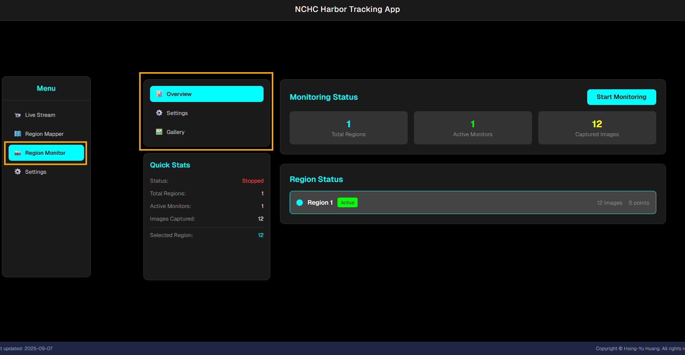

* **操作方法**
    * 在頂部找到主控制開關
    * 點擊「Start Monitoring」開始監控
    * 監控啟動後按鈕會變為「Stop Monitoring」
    * 系統會即時分析各區域的物件活動
 

#### 4-2-2. Quick Stats (區域狀態檢視)

左下角區塊，會即時呈現監控狀態下的系統狀態：

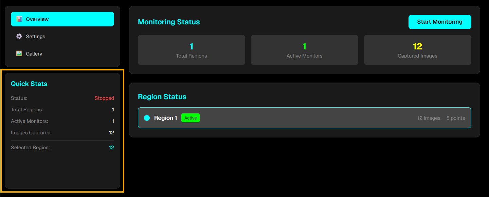

每個區域顯示的資訊包括：
* **區域名稱**: 可點擊進入詳細設定
* **啟用狀態**: 綠色表示已啟用，灰色表示未啟用
* **觸發物件**: 當前設定的觸發物件類型
* **截圖數量**: 該區域已捕獲的截圖總數
* **最後活動**: 最近一次偵測到活動的時間
 

### 4-3. Settings 區域設定

#### 4-3-1. 選擇要設定的區域

* 先在 Overview 標籤頁面中，選擇要設定的 Region。
    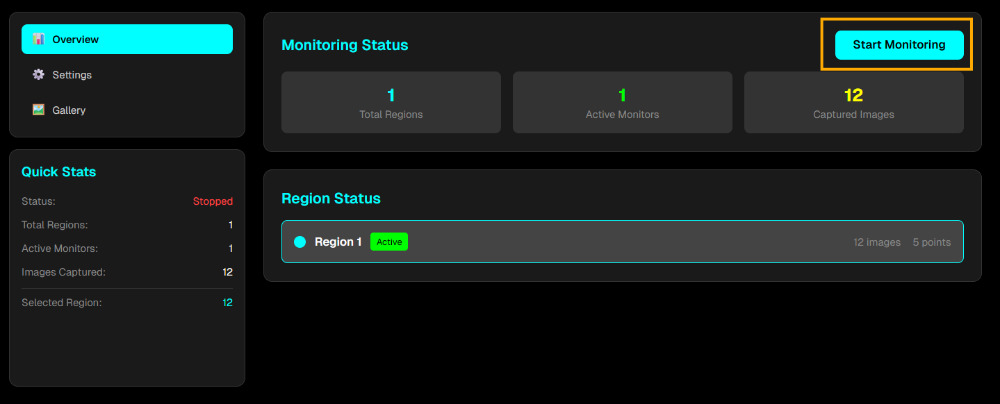
* 如上圖所示，現在將選擇針對 Region 2 做設定。
* 點擊 Settings 標籤頁進入區域監控設定。

    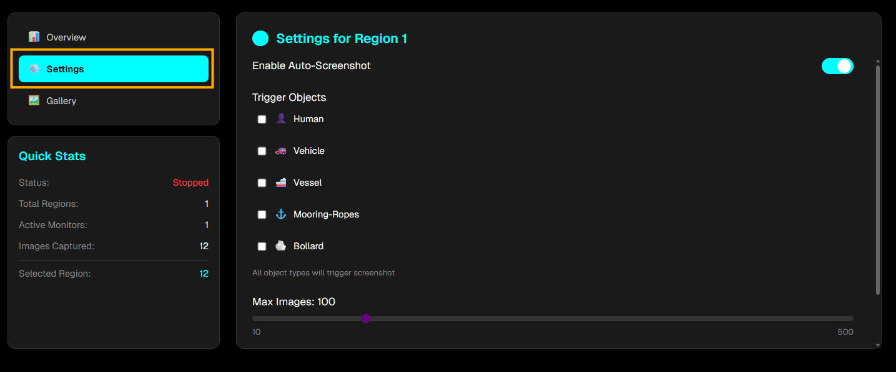
 

#### 4-3-2. 監控設定選項

* **Enable Auto-Screenshot (啟用/關閉自動截圖)**
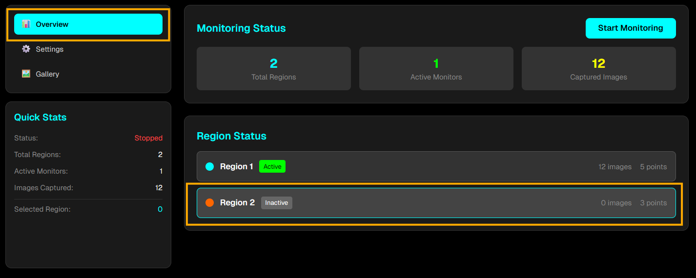
    * 找到「Enable Auto-Screenshot」開關
    * 點擊切換該區域的監控狀態
    * 僅啟用的區域會進行自動截圖
 

* **Trigger Objects (觸發物件類型選擇)**
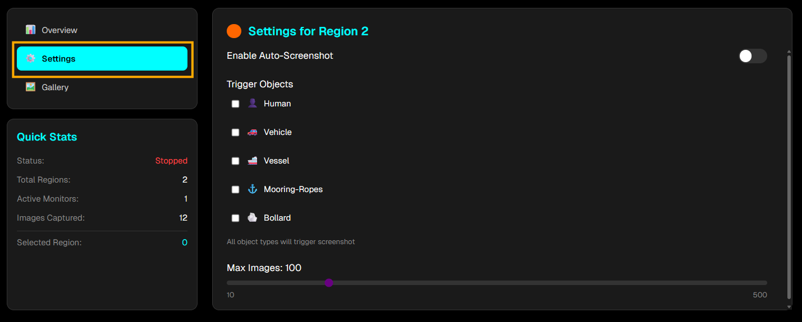
    * 在「Trigger Objects」區塊中選擇要監控的物件類型
    * 支援多選，可選擇多種物件類型
    * 當選中的物件類型出現在區域內時會觸發截圖
 

    物件類型說明：
    * 如果未選擇任何類型，任何偵測到的物件都會觸發截圖
    * 選擇特定類型可提高監控的針對性
    * 建議根據實際監控需求選擇相關的物件類型
 

* **最大截圖數量設定**
    * 使用「Max Images」滑桿設定該區域最多保存的截圖數量
    * 範圍：10 - 500 張
    * 超過限制時會自動刪除最舊的截圖
 

### 4-4. Gallery (截圖畫廊)

Gallery 標籤頁提供截圖的檢視和管理功能。

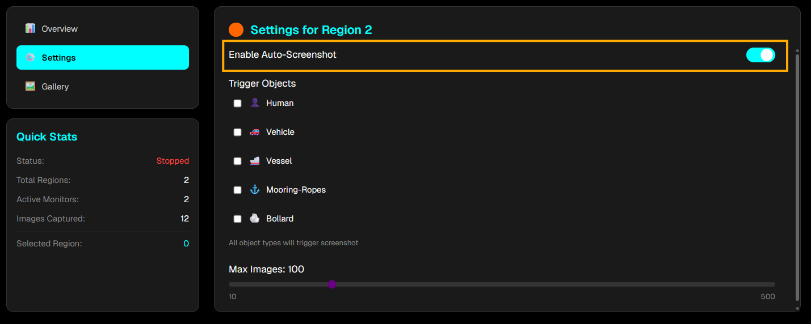

#### 4-4-1. View Mode (檢視模式切換)

* **操作方法**
    * **Grid View (網格檢視)**: 以縮略圖網格方式顯示
    * **List View (列表檢視)**: 以詳細列表方式顯示
 

#### 4-4-2. 截圖操作

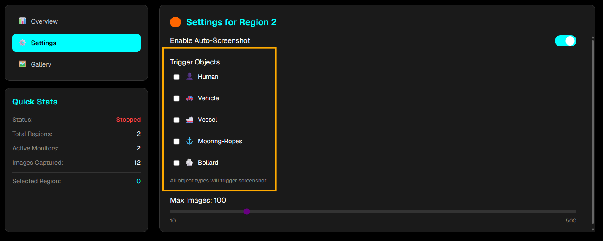

* **下載截圖**
    * 在截圖上找到點擊 Download，即下載該截圖到本地
    * 檔案名稱會自動包含區域名稱和時間戳記
 

* **刪除單張截圖**
    * 在截圖上找到刪除圖示，點擊後會被永久刪除

 

* **刪除所有截圖**
    * 在 Gallery 頁面頂部找到「Delete All Images」按鈕
    * 點擊後所有區域的截圖都會被刪除
 

### 4-5. 監控工作流程建議

* **設定階段**:
    * 先在 Region Mapper 中建立監控區域
    * 在 Region Monitor Settings 中配置各區域的監控參數
    * 選擇適當的觸發物件類型和截圖數量限制
 

* **監控階段**:
    * 在 Overview 頁面啟動監控
    * 定期檢查區域狀態和活動記錄
    * 根據需要調整監控參數
 

* **檢視階段**:
    * 使用 Gallery 檢視和管理截圖
    * 下載重要的截圖進行存檔
    * 定期清理不需要的截圖以節省空間

---

## 6. 常見問題與解決方案

**Q1: 影像無法顯示或顯示錯誤**

A: 
* 確認伺服器是否正常運行
* 嘗試重新整理頁面
 

**Q2: 影像延遲嚴重**

A:
* 檢查網路頻寬
* 關閉其他消耗頻寬的應用程式
 

**Q3: 無法建立區域或區域形狀不正確**

A:
* 確認已點擊「Add Region」按鈕
* 檢查是否有足夠的點數（最少 3 個）
* 確認點擊了第一個橙色點來完成區域
* 嘗試重新整理頁面
 

**Q4: 區域邊界無法調整**

A:
* 確認不在 Add Region (新增區域) 模式中
* 嘗試更精確地點擊邊界點
* 檢查滑鼠是否正常工作
 

**Q5: Auto-Screenshot (自動截圖) 不工作**

A:
* 確認已啟動 Start Monitoring (監控功能)
* 檢查區域是否已啟用 Enable Auto-Screenshot (自動截圖)
* 確認選擇了正確的 Trigger Objects (觸發物件類型)
 

---

**版本**: 1.0  
**最後更新**: 2025年9月  
**文件語言**: 繁體中文

---

*本手冊為 Harbor Tracking App 官方使用者指南。如有任何疑問或建議，歡迎聯絡我們的技術支援團隊。*
